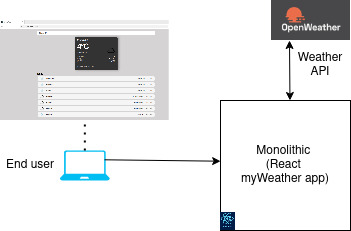
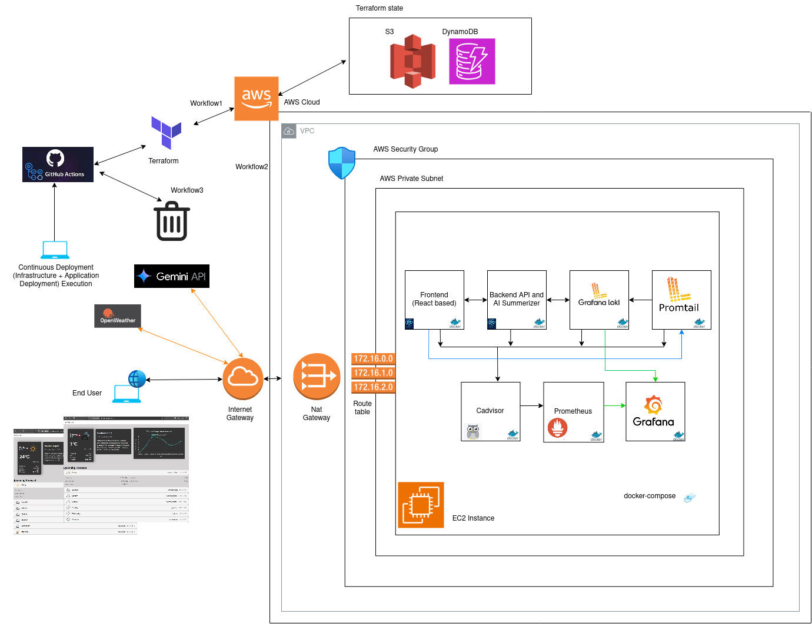
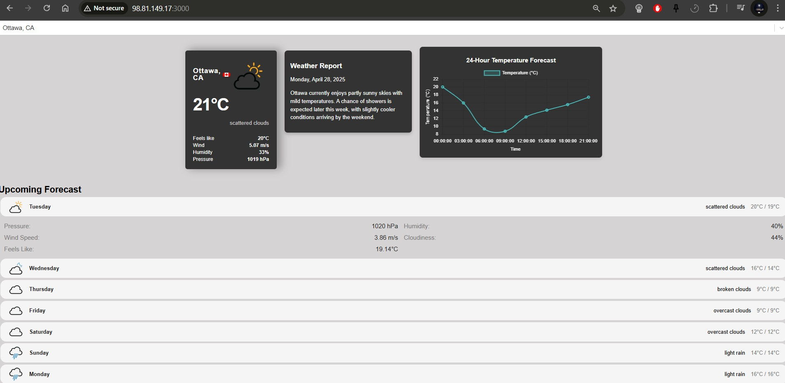
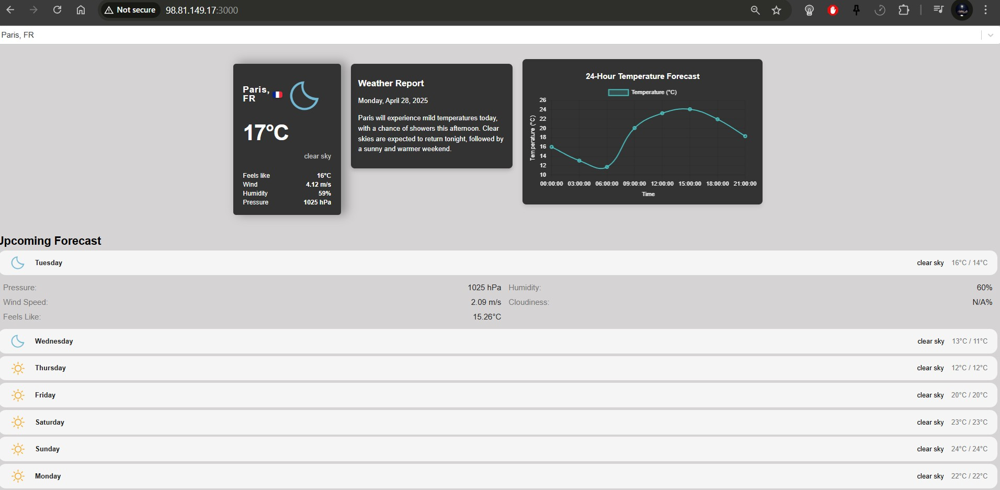
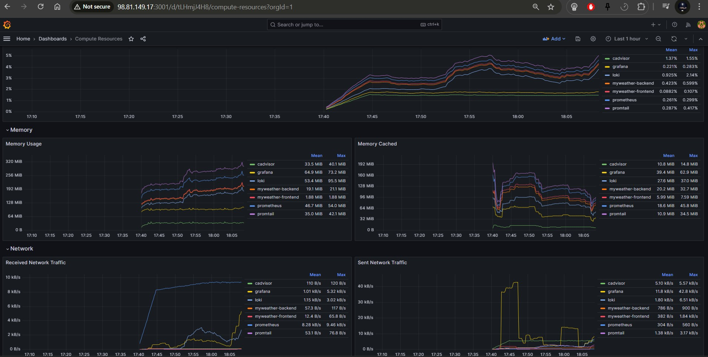
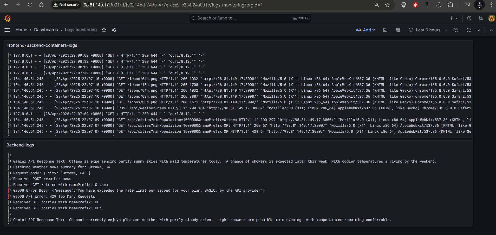

## MyWeather App

MyWeather App is a containerized microservice application featuring a React frontend, a backend openweather, Google Gemini Weather API for city weather summerzinig as part of my personal project both for fun and to demonstrate Devops and microservice application development skill and this Respository demonstrates how to set up the application locally and on AWS Cloud ( not multi-cloud/ Kubernetes yet) using Docker Compose and showcases a CI/CD pipeline( using Github actions) for automated building, testing, and integration.

## Initial Monolithic Application Architecture

Initial Architecture, Thanks to the sample react application from freecodecamp.org



Later after continous learning, patience and effort. I have converted thiis monolithic application into microservice application and also added some 
features like Free Google Gemini Weather Summerizer within 25 words based on the city which is searched on the Frontend application usings its API from GCP Google Cloud all along with the Free openweather API to fetch specific city weather patterns.

## Final Architecture

Later after continous learning, patience and effort. I have converted thiis monolithic application into microservice application and also added some 
features like  
Google Gemini Weather Summerizer within 25 words based on the city which is searched on the Frontend application usings its API from GCP Google Cloud and next 24 hours weather Chart Graph.



## Prerequisites

- Docker
- Docker Compose
- AWS CLi
- Terraform 
- Openweather API
- Gemini API

## Environment Variables

update the `.env` file in the root of your project to store your environment variables:

```plaintext
REACT_APP_GEO_API_URL=https://wft-geo-db.p.rapidapi.com/v1/geo
REACT_APP_RAPIDAPI_KEY=<your key>
REACT_APP_RAPIDAPI_HOST=wft-geo-db.p.rapidapi.com

WEATHER_API_URL=https://api.openweathermap.org/data/2.5
WEATHER_API_KEY=<your key>
```

## Docker Compose

### Create the AWS Cloud Infrastructure and download/build and start the application.

I have used Github actions to initially do the CI-CD pipeline work along with Terraform integration to seemlessly deploy the required Infrastructure on the AWS Cloud starting with initializing Terraform script and creating Terraform state services on AWS S3 and DynamoDB to secure its state file and then create the Infrastructure and then deploy the application code from the Github respository and install docker-compose and build/start the microservice container application using docker-compose.


## Services

### React Frontend

The React frontend is served on port 3000. It uses environment variables to configure the API URLs and headers.

## Sample Application weather Search




### Backend Server

The backend server is served on port 5001. It uses environment variables to configure the Redis and PostgreSQL connections, as well as the OpenWeatherMap API.

### Prometheus

Prometheus is used for monitoring and scraping metrics from the backend, Redis, and PostgreSQL services. It is accessible on port 9090.

- **Configuration**: The Prometheus configuration file (`prometheus.yml`) is mounted into the container.
- **Metrics Endpoint**: Prometheus scrapes metrics from the `/metrics` endpoint exposed by the backend service.

### Grafana

Grafana is used for visualizing metrics collected by Prometheus. It is accessible on port 3001.

- **Default Credentials**:
  - Username: `admin`
  - Password: `admin` (or the value set in the `GF_SECURITY_ADMIN_PASSWORD` environment variable).
- **Prometheus Data Source**:
  - URL: `http://prometheus:9090`
  - URL: `http://loki:3100`
  - I have created and already imported the json file as part of container build process so once the grafana container start both the prometheus and Loki based dashboard are available to monitor metrics and look out for all sort of errors.

  Prometheus datasource based dashboard
  

  Loki datasource based dashboard
  

## Additional Information

### CI/CD Pipeline

This repository includes a demonstration CI/CD pipeline (e.g., using GitHub Actions, GitLab CI, etc. - *adjust based on your specific implementation*). The pipeline automates the following steps:

1.  **Linting & Formatting**: Checks the codebase for style consistency and potential errors (e.g., using linters like ESLint for the frontend and Ruff/Flake8 for the backend).
2.  **Testing**: Executes automated tests (unit, integration) to ensure code quality and functionality.
3.  **Docker Image Building**: Builds Docker images for the application services (frontend, backend).
4.  **Docker Image Pushing**: Pushes the built images to a container registry (e.g., Docker Hub, GitHub Container Registry).
5.  **(Optional) Deployment**: Deploys the application to a target environment (this step might vary depending on the specific demo setup).

Refer to the pipeline configuration file (e.g., `.github/workflows/ci.yml`) in the repository for the exact implementation details.

## Challenges and Lessons Learnt

Here are the few challenges and best practices I implemented through this project journey.

*   **Backend API Integration:**
    *   Integrating multiple external APIs (OpenWeather, Gemini) required careful handling of different response structures, potential rate limits, and error conditions.
    *   Transforming and combining data from these sources into a consistent format for the frontend needed thoughtful design in the backend service.
    *   Debugging issues related to API keys, request formats, or unexpected API responses was sometimes time-consuming.
*   **Automating Terraform State:**
    *   Setting up the S3 bucket and DynamoDB table for Terraform's remote state backend *before* running the main `terraform init` and `plan/apply` presented a classic "chicken-and-egg" problem within a fully automated pipeline.
    *   Solutions explored included:
        *   Manual pre-creation of the state resources (less ideal for full automation).
        *   Using a separate, simpler Terraform configuration or script (e.g., AWS CLI commands within the pipeline) specifically to bootstrap the state backend resources before running the main infrastructure deployment.
    *   Ensuring the state backend was configured correctly early in the pipeline was crucial for reliable infrastructure management.
*   **Microservice Complexity:** Converting from a monolithic structure introduced complexities in inter-service communication (though minimal in this specific setup), environment variable management across services, and debugging across container boundaries.
*   **CI/CD Pipeline Design:** Defining the stages (lint, test, build, deploy), managing secrets securely (like API keys and AWS credentials in GitHub Actions), and ensuring smooth handoffs between steps required careful planning and iteration.
*   **Infrastructure as Code (IaC):** While Terraform significantly simplifies infrastructure management, writing robust and reusable modules, managing dependencies, and handling infrastructure drift requires ongoing learning and discipline.
*   **Monitoring Setup:** Configuring Prometheus scraping and Grafana dashboards, especially getting the right PromQL queries and Loki setup for logs, involved a learning curve but proved invaluable for observing the application's behavior.

Overall, the journey highlighted the power of automation (CI/CD, IaC) but also the attention to detail required to make these systems work reliably. It reinforced the importance of monitoring and the iterative nature of building and refining both applications and their deployment processes.

---

### Environment File Security

Ensure that the `.env` file is not committed to version control by adding it to your `.gitignore` file:

```plaintext
# .gitignore
.env
```

This will help keep your sensitive information secure.
```

### Summary:
1. **Environment Variables**: Create a .env file to store environment variables.
2. **Docker Compose Commands**: Include commands to start and stop the application using Docker Compose.
3. **Services**: Describe the services (React frontend, Redis, PostgreSQL, backend server) and their configurations.
4. **Logging**: Explain the logging configuration.
5. **Additional Information**: Ensure the .env file is not committed to version control.
( Here I have commited the .env file for quick validation)

These updates to the README.md file will provide clear instructions on how to set up and run the application, as well as how to manage environment variables and logging.